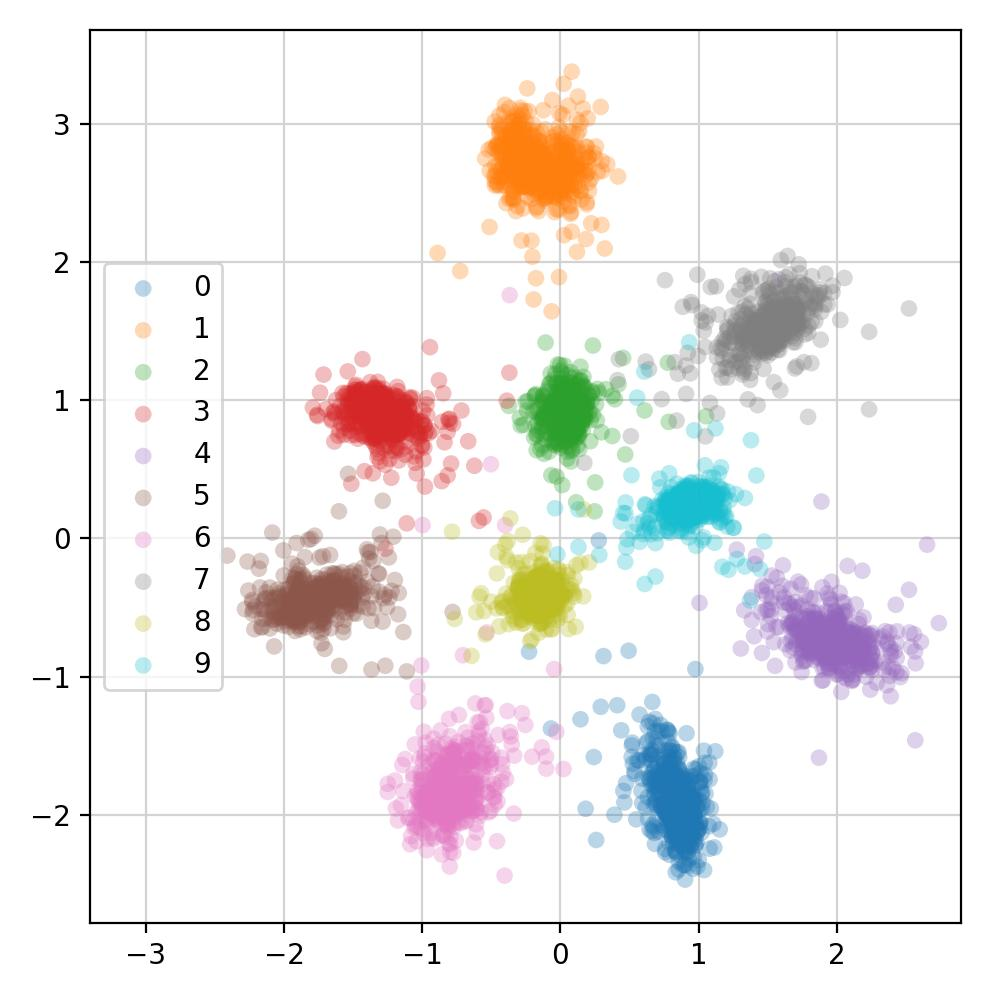

# Contrastive learning

This repo contains an example of contrastive representation learning.
An embedding can be trained in such a way that similar samples (sharing the same label)
are pulled together, while dissimilar ones (with different labels) are pushed apart.

<p>
  
</p>


## Notebooks

- [Introduction](notebooks/intro.ipynb)

- [MNIST example](notebooks/mnist.ipynb)


## Installation

```
pip install -e .
```


## Training

```
python scripts/main.py fit --config config/mnist.yaml
```

